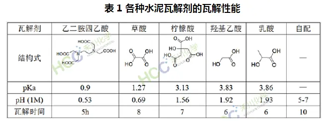

# 自制“水泥克星”瓷砖地砖清洗剂

作者：四不象（来自豆瓣）
来源：https://www.douban.com/note/718892782/

所谓的“水泥克星”就是用来清除装修后留在瓷砖表面水泥渍的去污剂，主要成分是可以分解水泥的酸和表面活性剂。这类清洗剂通常使用的是草酸。草酸是一种强有机酸，可以腐蚀水泥玻璃木材，有轻微毒性。我不推荐用草酸来DIY。

其他可供选择的廉价有机酸有柠檬酸和醋酸（ 乙酸 ）。因为醋酸的气味比较难闻，所以最后选择使用柠檬酸。淘宝或阿里巴巴上，花九块九可以买到一公斤的散装柠檬酸。据说用醋酸和柠檬酸的混合酸清洗效果更佳，不过调配比例并不清楚。

表面活性剂的话，可用洗洁精代替。当然，洗衣液也可以，但是有些洗衣液是碱性的，会中和掉柠檬酸的酸性，所以在没有PH试纸的条件下，还是选择中性的洗洁精比较好。

柠檬酸和温水按照1:50的比例调制，再加入适量的洗洁精，灌入喷壶，对着瓷砖地砖表面喷洒，等几分钟后用刷子刷几下，水泥渍就洗掉了。不仅可以用于清除水泥渍，也可以去除锈渍、水垢等其他污垢。

注意：**酸性清洁剂慎用于大理石表面。**

